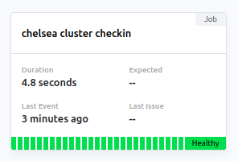

# cluster-checkin

<!--

  

-->

Cronjob that checks in with [cronitor.io](https://cronitor.io/) and alerts if the following items in a cluster are off.

- The job fails to checkin
- Any nodes are not in a `Ready` state
- Any pods in the `kube-system` namespace are not in a `Running` state

See also the [status page](https://premiscale.cronitorstatus.com/).